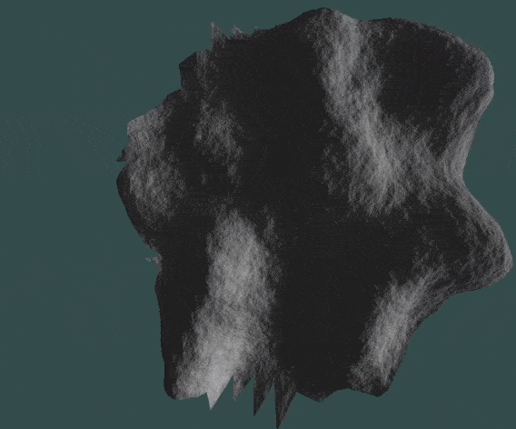

# Procedural-Spherical-Map-generation-using-OpenGL

## High Resolution Procedural Surface Construction Demo

## Surface Construction Demo With Reference Sphere

## Project Description

This is an OpenGL programthat procedurally contructs a surface of an arbitrary 3D spherical Surface With Noise.

The 3D surface is made up of lots of triangular chunks, and each triangualar chunk is also subsidived into lots of smaller triangles. Each subdivided triangle is then applied perlin noise to create pseudorandom noise and to make hills and 3D terrain.

Each triangular chunk is stored in a hash table by hashing the coordinate of each chunk for generating hash key. So, the program only stores the triangular chunks that are closest to the camera, and deletes the ones that are far away. In this way, RAM usage is optimized since we don’t want to store the surface data that belongs to the other side of the random planet especially if the planet is giant. For further optimization, deleted triangles are recycled and reused.

Therefore this program allows generating infinitely large randomly generated Planet Surface data in an optimized way so that the RAM usage is independant from the Planet size. 
